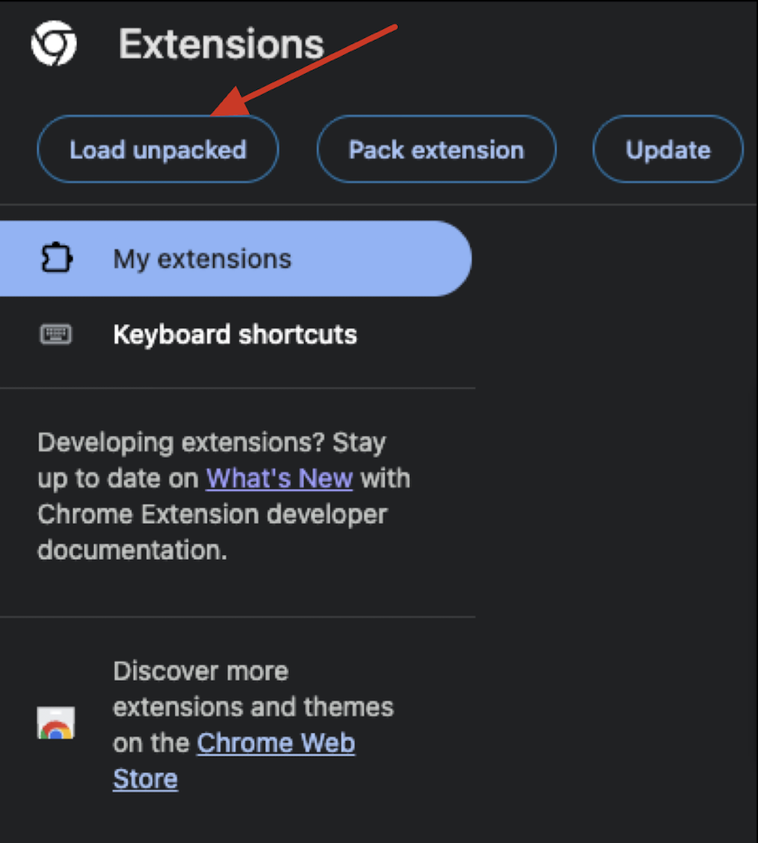
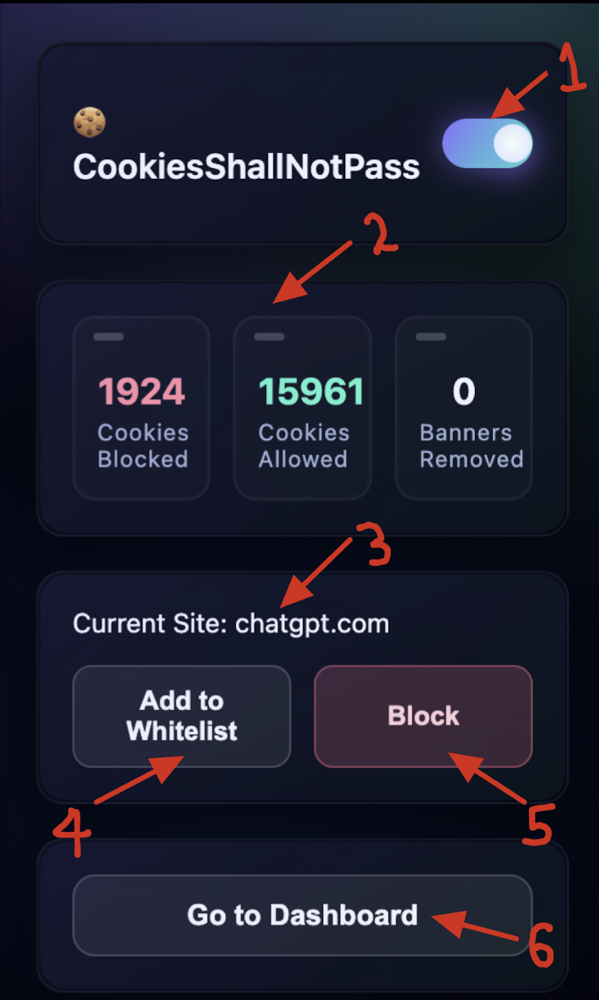
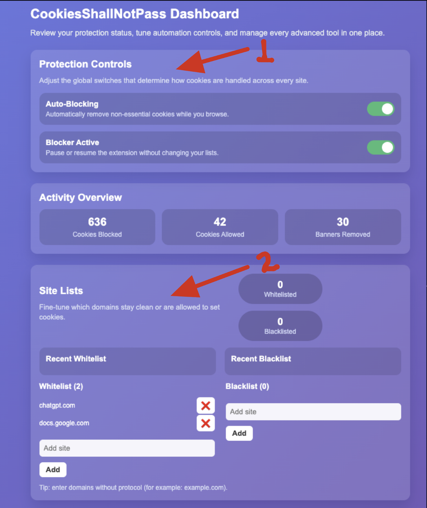
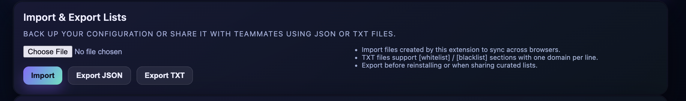

# User Documentation

### High Level Description
**CookiesShallNotPass** is a chrome extension that automatically manages website cookie preferences. It blocks non-essential cookies, removes intrusive cookie banners, and allows users to whitelist trusted sites or import pre-defined blocklists making cookie management automatic, simple, and private.

### How to install the software from Chrome(in progress)
To install the latest published version of the extension, download it from the Chrome web store.

---

### How to install the software from source
Since the extension hasn’t been published to the Chrome Web Store yet, you can install it manually from source:
https://github.com/AryanV08/CookiesShallNotPass/tree/main

-Download or clone this repository to your local machine.
-Open Google Chrome and navigate to chrome://extensions/.
-Enable Developer mode using the toggle in the top right corner.
-Click “Load unpacked” and select the folder containing the extension’s source code.
-The extension should now appear in your toolbar, ready to use.

---

#### How to run the software
- Launch Google Chrome  
- Make sure you're using a supported version of Google Chrome  
- Activate the Extension  
- Click the small puzzle icon in the top right corner of your Chrome browser  
- Pin CookiesShallNotPass for quick access if desired  
- Click the extension icon to open the pop-up interface  

---

#### How to use the software
Once the extension is installed and enabled in Chrome, you can manage it easily through the popup interface and the dashboard.  

This section explains how to use all main features.  

---
**Opening the Extension Popup**  
- Click the CookiesShallNotPass icon in the Chrome toolbar.  
- This opens a compact popup window, your main control center for quick cookie management.  

**Popup Features**  
The popup gives you direct access to essential controls while browsing.  

- **Enable or Disable the Blocker (1):**  
  - Use the turn On/Off toggle to activate or pause cookie blocking.  
  - When enabled, the extension automatically blocks non-essential cookies based on your preferences and lists. When disabled, all cookies will behave normally as in Chrome.  

- **Cookie Stats (2):**  
  - Cookies Blocked So Far: Number of cookies that have been blocked so far.  
  - Cookies Allowed: Number of cookies permitted so far.  
  - Banners Removed: Number of cookie banners removed so far.  

- **Current Site Display (3):**  
  - The popup shows the current website you’re visiting. This helps confirm which site you’re managing before adding it to a list.  

**Managing Sites**  
- **Add to Whitelist (4):**  
  - Click “Add to Whitelist” to allow cookies from the current domain.  
  - Whitelisted sites will bypass the blocker, keeping their cookies active.  

- **Add to Blacklist (5):**  
  - Click “Block” to completely block non-essential cookies on the current website.  
  - The site will be added to your blacklist automatically.  

**Dashboard**  
- Click “Go to Dashboard (6)” in the popup to open the main management panel.  
- The dashboard provides advanced tools and customization for your cookie preferences.  

**Edit Preferences (1):**  
- Manage your extension settings directly from the dashboard.  
  - Auto-Blocking: Turn automatic cookie blocking on or off globally.  
  - Blocker Status: Use the turn On/Off toggle to activate or pause cookie blocking. 

**View and Edit Lists (2):**  
- View all websites you’ve added to your Whitelist and Blacklist.  
- Add or remove sites manually.  

**Graphical Statistics (not implemented yet):**  
- Visualize your browsing privacy.  
  - Total cookies blocked vs. allowed  

**Import / Export Lists:**  

- Import: Upload a TXT (with [whitelist]/[blacklist] sections, one domain per line) or JSON file of sites to whitelist or blacklist.  
- Export: Download JSON or TXT snapshots of your current lists for backup or sharing across devices.  

**Report a Bug:**  
- Use the “Report a Bug” form directly from the dashboard.  
- Include the affected website, a short description of what happened, and optional steps to reproduce or a screenshot.  

**Notes**  
Some advanced features such as improved banner detection and detailed analytics are still in progress. CookiesShallNotPass runs automatically after installation, but you can always customize its behavior using the popup and dashboard.

---

Once the startup process is complete, ie, the extension icon is clicked and successfully opened, then:  
- Go to any website with a cookie consent banner  
- The extension will automatically detect and manage the banner according to your settings  
- You can open the pop-up to adjust preferences, view site logs, or whitelist/blacklist domains  

---

#### How to report a bug
1. Click the small puzzle icon in the top right corner of your Chrome browser.  
2. Locate the CookiesShallNotPass extension in the list and click it.  
3. Once clicked, the dashboard will pop up.  
4. Scroll to the bottom of the dashboard and click the “Report Bug” hyperlink.  
5. You will be directed to a Google Form where you can describe the issue.  

**To make your report most useful, please include the following details:**  
- **Summary:** A short, clear title (e.g., “Popup toggle not saving settings”).  
- **Steps to Reproduce:** Numbered steps showing exactly how the bug occurs.  
- **Expected Result:** What you thought would happen.  
- **Actual Result:** What actually happened.  
- **Environment:** Your operating system and Chrome version.  
- **Screenshot or Video (optional):** If it helps clarify the issue.  

---

### Known bugs
- All of the known bugs will be documented in our spreadsheet in the google forum  
- There will be no trivial bugs in the implemented use cases  

---

